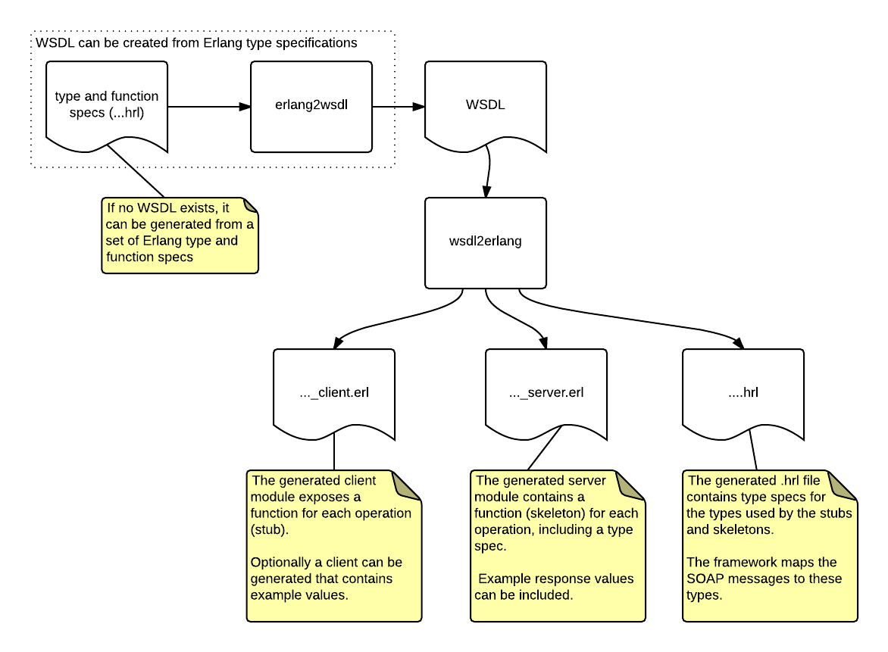

# soap
Erlang SOAP support - Make it easy to use SOAP from Erlang.

- Generate a SOAP client from a WSDL
- Generate a SOAP server from a WSDL
- Generate a WSDL from Erlang specifications
- Use your preferred HTTP client or server application

## Contents
- [Introduction](#introduction)
- [Documentation overview](#documentation-overview)
- [Building](#building)
  - [Dependencies](#dependencies)
- [Contributors](#contributors)

## Introduction 
The `soap` application provides functions to implement a SOAP client or server in Erlang.
It can easily be integrated with existing http client and server
applications. Integration for ibrowse, httpc, inets, cowboy and mochiweb is
provided.

The figure below provides a high level overview of the application and the
main integration points.


The starting point can be a WSDL for which you need to
implement an Erlang SOAP client or server, or an existing Erlang function
that you want to expose as a service (and for which you need a WSDL).

The figure below shows how the application can generate the relevant modules,
either starting from a WSDL ("contract first") or starting from a set of
Erlang type specifications ("contract last").




## Documentation overview
A [use cases document](doc/use_cases.md) gives an overview of the
application by describing the 3 main use cases:

1. [Implementing a SOAP client](doc/use_cases.md#implementing-a-soap-client) - Consume a web service.
1. [Implementing a SOAP server](doc/use_cases.md#implementing-a-soap-server) - Expose a web service.
1. [Creating a WSDL](doc/use_cases.md#creating-a-wsdl) - Expose a function as a web service
and generate a WSDL.


For more details there are additional documents:
- [Features, standards support and limitations](doc/supported_standards_and_limitations.md)
- [Client tutorial](doc/soap_client_tutorial.md) - describes the details of
  the generated client module.
- [Server tutorial](doc/soap_server_tutorial.md) - an example of
  how to implement a server from a WSDL (use case 2 above).
- [Server callbacks](doc/soap_server_callbacks.md) - a reference guide for
  the functions that may be provided for the implementation of a SOAP
  service.
- [Generating a WSDL from Erlang type specifications](doc/generating_a_wsdl.md) - 
  a more elaborate example of the "contract last" approach.
- [SOAP attachments](doc/soap_attachments.md) - How to create and use
  services with attachments.
- [Integrating a HTTP client](doc/integrating_a_http_client.md) - How to
  use another HTTP client.
- [Integrating a HTTP server](doc/integrating_a_http_server.md) - How to
  use another HTTP server.
- Reference guides:
  - [soap](doc/soap.md)
  - [soap_req](doc/soap_req.md)
  - [soap_fault](doc/soap_fault.md)
  - [soap_parsers](doc/soap_parsers.md)

## Building
rebar is used to build the software. 

```
rebar get-deps
rebar compile
```

Alternatively, just type `make` to compile the code, and `make ct` to run the tests (the Makefile invokes rebar).

### Dependencies
`soap` requires [erlsom](https://github.com/willemdj/erlsom), version v1.4.0 or later.

## Contributors
This `soap` application was developed by Willem de Jong(@willemdj) with design input from Chandru Mullaparthi(@cmullaparthi).  The development of this library was sponsored by [bet365](http://bet365.com).
