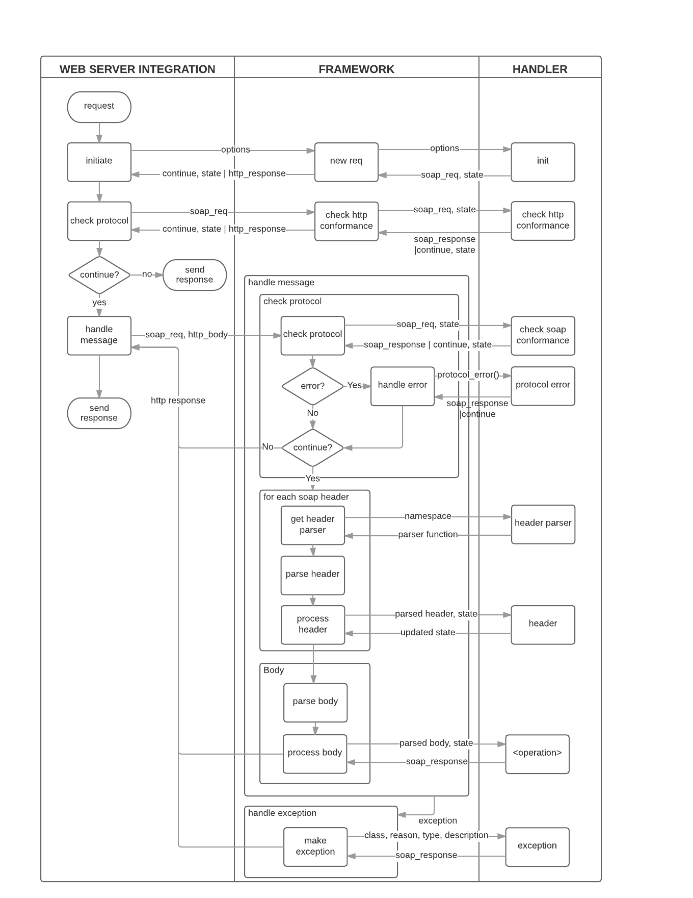

# Soap Server Reference #

- [Introduction](#introduction)
- [Data Types](#data-types)
- [Callback functions](#callback-function-index)

## Introduction
The implementation of a soap server must be
provided in a module that exports a number of callback functions. The
`soap` application will call these functions when it is handling a soap
request. Exactly which functions are called depends on the service
that is called, and possibly also on results of earlier callback calls
for that particular request.

All callback functions are optional, with the exception of the
functions that implement the operations that are specified in the
WSDL. These are exactly the functions for which skeletons are provided
in the output of `soap:compile_wsdl/1`.

The picture below provides an overview of how a soap request will be
handled. The rightmost column shows the callback functions and when
they are called. The labels on the arrows give an impression of the
information that is passed between the functions, but note that this
is not exhaustive. See the reference section below for a precise
description of the parameters.



## Data Types

### Data Type Index
- [soap_req()](#soap_req)
- [soap_handler_state()](#soap_handler_state)
- [soap_response(Body)](#soap_responsebody)
- [soap_response_message(Body)](#soap_response_messagebody)
- [soap_header()](#soap_header)
- [http_status_code()](#http_status_code)
- [protocol_error()](#protocol_error)

#### soap_req()
This is an opaque data type, used by the `soap` application to keep track of the
information related to a soap request. The relevant information can be
accessed via a set of functions provided by the `soap_request` module. Some
of the information can also be modified, therefore the callback functions
typically return a (new) soap_req.

#### soap_handler_state()

```erlang
`soap_handler_state() :: any().`
```

This is data that is passed by the `soap` application between the invocations
of the callback functions in the handler module. The `init` function
sets the initial value for a particular request.

#### soap_response(Body)

```erlang
soap_response(Body) :: 
    {ok, soap_body(Body), soap_req(), soap_handler_state()} |
    {ok, soap_body(Body), [soap_header()], soap_req(), soap_handler_state()} |
    {fault, soap_body(Body), soap_req(), soap_handler_state()} |
    {fault, soap_body(Body), [soap_header()], soap_req(), soap_handler_state()} |
    {error, http_status_code(), soap_req(), soap_handler_state()} |
    {raw, http_status_code(), binary(), soap_req(), soap_handler_state()}.
```

This is the response that must be provided by the handler module. It
is a representation of the answer that will be returned to the client,
combined with information that is used by the `soap` application (`soap_req()`)
and by the handler module (`soap_handler_state()`).


#### soap_body(Body)

```erlang
-type soap_body(Body) :: Body | iolist().
```

This is the representation of the SOAP body. `Body` is a type that
corresponds with the message that is allowed according to the WSDL (a
record). In the generated .erl and .hrl files these
types will be given.

Alternatively it can be an iolist(), in that case it must be an XML snippet
that will be literally copied to the response message.

#### soap_header()

```erlang
soap_header() :: tuple() | iolist().
```

This is a representation of a SOAP header block. It can be either a record
(i.e. a tuple) that corresponds with a type from the WSDL, or it can be an
XML snippet (represented as `iodata()`).

#### http_status_code()

```erlang
http_status_code() :: integer().
```

The HTTP status code that is used for the HTTP response. In principle
the code is prescribed by the SOAP specification: 200 for a successful
request, 500 for a SOAP fault, and various other other codes for
specific protocol errors.

#### protocol_error() 

```erlang
{method_not_allowed, string()} | {unsupported_media_type, string()}
```


## Callback Function Index
- [init/2](#init2)
- [check_http_conformance/2](#check_http_conformance2)
- [check_soap_conformance/2](#check_soap_conformance2)
- [protocol_error/3](#protocol_error3)
- [header_parser/3](#header_parser3)
- [header/3](#header3)
- [body_parser/3](#body_parser3)
- [exception/7](#exception7)


### init/2 ###

```erlang
init(soap_req(), Options::any()) -> {soap_req(), soap_handler_state()}
```

This is an optional callback. If it is provided, it will be called at
the start of every soap request. This allows the handler module to do
some initial setup per request.

The value for the `Options` argument depends on the details of the web
server implementation, see there. In general the idea is that options that
are specified at the start of the server are made available via this
argument.


### check_http_conformance/2 ###

```erlang
check_http_conformance(soap_req(), soap_handler_state()) -> 
    soap_response() | {continue, soap_req(), soap_handler_state()}
```

This is an optional callback. If it is provided it will be called
before the body of the http request is processed.

This callback can be used to check some of the requirements of the
protocol, related to content type, http method, soap action etc. A
`{continue, soap_req(), soap_handler_state()}` response will continue with
the processing of the request; a `soap_response()` request will immediately
send that response and perform nu further processing.

Note that the soap version (1.1 or 1.2) is not known when this
function is called, because it can only be derived from the namespace
of the soap envelope (in the http body).

The default action (if this callback is not provided) is to perform no checks at this point.

### check_soap_conformance/2 ###

```erlang
check_soap_conformance(soap_req(), soap_handler_state()) ->  
      soap_response() | {continue, soap_req(), soap_handler_state()}
```

This is an optional callback. If it is provided it will be called when
the parsing of the soap envelope has started, and the soap version is
known.

A `{continue, soap_req(), soap_handler_state()}` response will continue with
the processing of the request; a `soap_response()` request will immediately
send that response and perform no further processing.

If this callback is not provided, a default function will be invoked that executes the following checks:

|             |soap 1.1     | soap 1.2               | error code if not conformant
|-------------|-------------|------------------------|---------------------------------------
|http method  | "POST"      | "POST" or "GET"        | {method_not_allowed, Method}
|content type |  "text/xml" | "application/soap+xml" | {unsupported_media_type, Type}

If the default function returns an error, this is passed to the
`protocol_error` callback, see below.


### protocol_error/3 ###


```erlang
protocol_error(protocol_error(), soap_req(), soap_handler_state()) -> 
      soap_response() | {continue, soap_req(), soap_handler_state()}.
```

This optional callback is called if the default protocol checks detect an
error. (The table above shows the checks and the error codes).

A `{continue, soap_req(), soap_handler_state()}` response will continue with
the processing of the request; a `soap_response()` request will immediately
send that response and perform no further processing.

If this callback is not provided, a `method_not_allowed`-error Will result
in an HTTP error with status code 405, and an
`unsupported_media_type`-error will result in an HTTP error with status
code 415.


### header_parser/3 ###

```erlang
header_parser(Namespace::string(), soap_req(), soap_handler_state()) ->
    {ok, {erlsom_sax_callback(), callback_start_state()}, soap_req(), soap_handler_state()}.
```

This optional callback determines how a soap header-block must be parsed.

The soap header consists of zero or more header blocks. Each header
block must be namespace qualified. Based on the namespace it can be
specified how the contents must be parsed.

The return value contains a soap callback function and a start state. The
module `soap_parsers` provides a number of possible alternatives, such as a
parser that translates the header block to a map, or a parser that simply
skips the content of the header block. For more details see the [reference
for `soap_parsers`](soap_parsers.md].

The default return value is a parser that ignores the content of the header
block.

### header/3 ###

```erlang
header(Parsed_header::any(), soap_req(), soap_handler_state()) ->
  {ok, soap_req(), soap_handler_state()}
```

After the header block has been parsed, this (optional) callback is called. It takes the result of the parsing step as input, as well as the soap_req() and the soap_handler_state(). The result can be passed to the next step using the soap_handler_state() output element.

The default action is to do nothing, that is, the values of the soap_req() and soap_handler_state() parameters are returned unchanged.


### body_parser/3 ###

```erlang
body_parser(Namespace::string(), soap_req(), soap_handler_state()) ->
    {ok, {erlsom_sax_callback(), callback_start_state()}, soap_req(), soap_handler_state()}.
```

This optional callback determines how a soap body must be parsed, similar to 
[header_parser/3](#header_parser3).

The default is to apply the erlsom data mapper parser, which will
translate the soap body to a record (in accordance with the types
specified in the generated .hrl file).


### exception/7 ###


```erlang
exception(Class::atom(), Reason::any(), Stacktrace::any(),
          exception_type(), Description::string(), soap_req(), soap_handler_state()) -> 
          soap_response().
```

This optional callback will be called in case an exception occurs during
the handling of a request.

